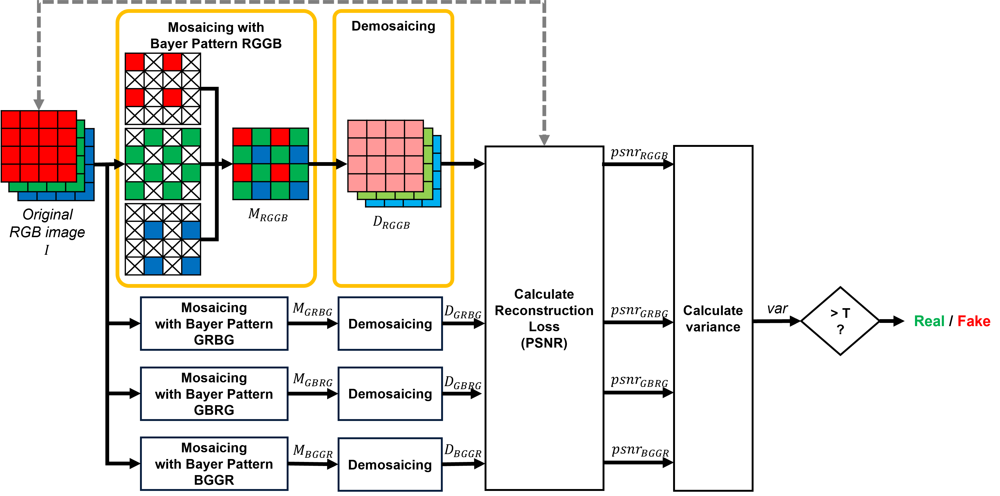

# Leveraging Bayer Pattern Analysis for Authenticity Detection of Real and Fake Images

This is the repository for paper [Leveraging Bayer Pattern Analysis for Authenticity Detection of Real and Fake Images](https://link.springer.com/chapter/10.1007/978-3-031-94962-3_2) accepted to CSCI 2024.

